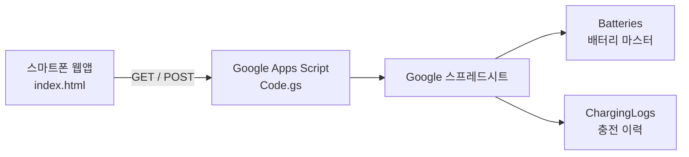

# BATLog

**리튬 배터리 충전 이력·수명 추적 웹앱**  
주식회사 해양드론기술 현장 작업자용 · iOS / Android 공용

여러 작업자가 함께 사용해도 데이터가 꼬이지 않도록 **Google 스프레드시트**에 이력을 누적하고, QR 스캔으로 배터리를 특정한 뒤 충전 사이클을 기록합니다.

---

## 라이브 주소

| 구분 | URL |
|------|-----|
| **웹앱 (GitHub Pages)** | https://zhaot3065.github.io/BATLog/ |
| **소스 코드** | https://github.com/zhaot3065/BATLog |

---

## 주요 기능

- QR 코드 또는 URL 파라미터(`?id=BT001`)로 배터리 조회
- 작업자 선택 후 충전 사이클 기록 (중복 클릭 방지)
- 기록 완료 시 확인 팝업 → 다음 배터리 스캔 화면으로 복귀
- 배터리별 **권장 수명(MaxCycles)** 초과 시 사용 주의 표시
- QR에 API URL + 배터리 ID 동시 인식 지원

---

## 시스템 구성



| 구성요소 | 역할 |
|----------|------|
| `index.html` | 모바일 웹 UI (QR 스캔, 기록, 수명 경고) |
| `apps-script/Code.gs` | REST API (`doGet` / `doPost`) |
| Google 스프레드시트 | DB (배터리 목록 + 충전 로그) |
| GitHub Pages | 프론트엔드 HTTPS 호스팅 |

---

## 프로젝트 구조

```
BATLog/
├── index.html              # 웹앱 (단일 파일)
├── apps-script/
│   └── Code.gs             # Google Apps Script 백엔드
├── scripts/
│   ├── publish-github.ps1  # GitHub push + Pages 설정
│   └── extract_legacy_batteries.py  # 재고 → seed 산출 (BATLog 전용)
├── artifacts/              # 코드 외 산출물
│   └── seed/               # Batteries 시트용 CSV·JSON
├── SETUP.md                # 상세 설정 가이드
└── README.md
```

범용 도구(xlsx 읽기 등)는 형제 폴더 `D:\WorkSpace\Code\utility` 에 둡니다.  
WMP 등 다른 프로젝트는 `D:\WorkSpace` 루트 Git으로 관리하고, **BATLog만** 이 폴더에서 commit/push 합니다.

---

## 초기 설정

### 1. Google 스프레드시트

#### `Batteries` 시트

| A: BatteryID | B: Model | C: StartDate | D: MaxCycles |
|--------------|----------|--------------|--------------|
| LPO-6S-22-001 | 6S 22000mAh (LiPo) | 2026-01-01 | 300 |

#### `ChargingLogs` 시트

| A: Timestamp | B: BatteryID | C: Worker |
|--------------|--------------|-----------|

1행은 반드시 헤더로 유지합니다. `ChargingLogs` 2행 이후는 앱이 자동으로 채웁니다.

### 2. Google Apps Script

1. 스프레드시트 → **확장 프로그램** → **Apps Script**
2. `apps-script/Code.gs` 내용 붙여넣기
3. **배포** → **새 배포** (또는 기존 배포 **새 버전**)
   - 유형: **웹 앱**
   - 실행 사용자: **나**
   - 액세스: **모든 사용자**
4. 배포 URL을 `index.html`의 `API_URL`에 입력

> 코드 수정 후에는 **배포 관리 → 새 버전**으로 업데이트하면 URL을 유지할 수 있습니다.

### 3. 프론트엔드 설정 (`index.html`)

```javascript
const API_URL = 'https://script.google.com/macros/s/....../exec';
const DEFAULT_MAX_CYCLES = 300;       // 시트 D열 없을 때 기본 수명
const LIFECYCLE_WARNING_RATIO = 0.9;  // 90%부터 '수명 임박' 경고
const WORKERS = [ /* 작업자 목록 */ ];
```

### 4. GitHub Pages 배포

`main` 브랜치에 push하면 GitHub Pages에 자동 반영됩니다.

```powershell
git add .
git commit -m "변경 내용"
git push
```

최초 설정은 `scripts/publish-github.ps1` 참고.

---

## Battery ID 규칙

```
{CHEM}-{N}S-{용량Ah}-{순번}
```

| 코드 | 종류 | 예시 |
|------|------|------|
| LPO | LiPo | `LPO-6S-22-001` (6S 22000mAh) |
| LIO | Li-ion | `LIO-6S-16-001` |
| LFE | LiFe | `LFE-4S-10-001` |
| NMH | NiMH | `NMH-6S-5-001` |
| SSE | 전고체 | `SSE-6S-22-001` |
| SSI | 반고체 | `SSI-6S-22-001` |

관리자 등록 화면에서 종류·셀·용량을 선택하면 ID와 Model이 자동 생성됩니다. 기존 `BT001` 형식 ID도 스캔·기록은 계속 됩니다.

---

## 관리자 — 배터리 등록 · QR 라벨

웹앱 우측 상단 **자물쇠 아이콘** → PIN 로그인 → **배터리 등록** 버튼

1. 관리자 PIN 입력 (초기값 `8842`, 로그인 후 변경 가능)
2. **배터리 등록** — 새 배터리 등록 후 QR 생성
3. **QR 재출력** — 등록된 Battery ID로 라벨·QR 다시 다운로드
4. 라벨/QR 크기 선택 후 **PNG 다운로드** → 앱손 프린터 앱에서 출력

| 다운로드 | 용도 |
|----------|------|
| 라벨 PNG | ID·모델·QR이 포함된 열전사 라벨 (820×520px) |
| QR만 PNG | QR 코드만 필요할 때 |

> Apps Script에 `action=register` API가 포함된 **최신 코드 재배포**가 필요합니다.

---

1. 웹앱 접속 (또는 홈 화면 바로가기)
2. **QR 스캔 시작** → 배터리 QR 인식
3. 배터리 정보 확인 (수명 경고 있으면 상단 배너 표시)
4. **작업자 선택** (필수)
5. **충전 기록하기 (+1 사이클)** 클릭
6. 기록 완료 팝업 확인 → **다음 배터리 스캔**

---

## QR 코드 형식

| 형식 | 예시 | 비고 |
|------|------|------|
| **웹앱 링크 (권장·QR 라벨)** | `https://zhaot3065.github.io/BATLog/?id=LPO-6S-22-001` | 카메라·앱 스캔 모두 가능 |
| ID만 | `LPO-6S-22-001` | `API_URL` 설정 필요 |
| 레거시 BATLOG | `BATLOG\|https://script.google.com/.../exec\|LPO-6S-22-001` | 예전 라벨 호환 |
| Apps Script URL | `https://script.google.com/.../exec?id=BT001` | 앱 QR 스캔용 (기본 카메라는 JSON만 표시) |

---

## 수명 경고 기준

| 상태 | 조건 |
|------|------|
| 정상 | 권장 수명의 90% 미만 |
| 수명 임박 | 90% 이상 ~ 수명 미만 |
| 수명 도달 | 현재 사이클 = MaxCycles |
| **사용 주의** | 현재 사이클 > MaxCycles |

`MaxCycles`는 `Batteries` 시트 D열에 배터리별로 설정합니다. 비어 있으면 `DEFAULT_MAX_CYCLES`를 사용합니다.

---

## API 개요

### `GET ?id=BT001`

배터리 정보 및 현재 사이클 수 조회

```json
{
  "success": true,
  "id": "BT001",
  "model": "6S 22000mAh",
  "startDate": "2026-01-01",
  "maxCycles": 300,
  "cycleCount": 12
}
```

### `POST` (id, worker)

충전 로그 1건 추가

```json
{
  "success": true,
  "id": "BT001",
  "worker": "홍길동",
  "timestamp": "2026-05-31 14:20:05",
  "maxCycles": 300,
  "cycleCount": 13
}
```

---

## 스마트폰 홈 화면 추가

자동 설치는 불가능합니다. 사용자가 한 번 직접 추가해야 합니다.

- **iPhone (Safari):** 공유(↑) → **홈 화면에 추가**
- **Android (Chrome):** 메뉴(⋮) → **홈 화면에 추가** 또는 **앱 설치**

---

## 주의사항

- `index.html`에 **API URL**이 포함되어 있으므로 **공개 저장소** 사용 시 URL이 노출됩니다.
- QR 카메라는 **HTTPS** 환경에서만 정상 동작합니다 (`file://` 불가).
- Apps Script **새 배포** 시 URL이 바뀔 수 있습니다. 기존 URL 유지는 **새 버전** 배포를 사용하세요.

---

## 라이선스 / 문의

내부 업무용 프로젝트 · [주식회사 해양드론기술](https://marine-drone.co.kr/)
