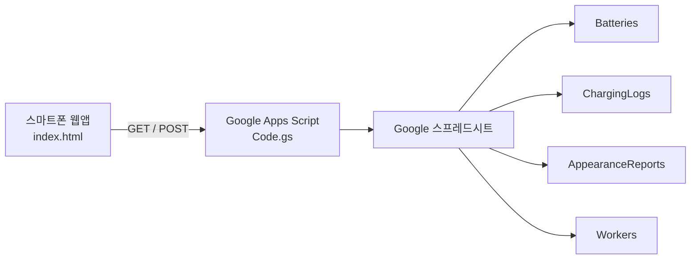

# BATLog

**리튬 배터리 충전 이력·수명 추적 웹앱**  
주식회사 해양드론기술 현장 작업자용 · iOS / Android 공용

여러 작업자가 함께 사용해도 데이터가 꼬이지 않도록 **Google 스프레드시트**에 이력을 누적하고, QR 스캔 또는 ID 입력으로 배터리를 특정한 뒤 충전 사이클을 기록합니다.

---

## 라이브 주소

| 구분 | URL |
|------|-----|
| **웹앱 (GitHub Pages)** | https://zhaot3065.github.io/BATLog/ |
| **소스 코드** | https://github.com/zhaot3065/BATLog |

---

## 주요 기능

- QR 코드, URL 파라미터(`?id=LPO-7S-35-001`), **ID로 조회**로 배터리 검색
- **Workers** 시트 기반 작업자 목록 · 드롭다운 하단 **+ 신규 등록**
- 충전 사이클 기록 (중복 클릭·60초 내 동일 기록 방지)
- 기록 완료 후 **QR 스캔 자동 재개**
- 외관 점검 · **외관 이상 보고** → 알림 메일 · 사용 차단
- 관리자 **조치완료 / 폐기** (설정 목록 또는 스캔 화면)
- 배터리별 **권장 수명(MaxCycles)** 초과 시 사용 주의 표시
- QR 라벨 생성 · 재출력 (관리자)

---

## 시스템 구성



| 구성요소 | 역할 |
|----------|------|
| `index.html` | 모바일 웹 UI (QR 스캔, 기록, 외관 보고, 관리자) |
| `apps-script/Code.gs` | REST API (`doGet` / `doPost`) |
| Google 스프레드시트 | DB (배터리·충전·외관·작업자) |
| GitHub Pages | 프론트엔드 HTTPS 호스팅 |

---

## 프로젝트 구조

```
BATLog/
├── index.html
├── apps-script/Code.gs
├── assets/                 # 앱 아이콘 등
├── scripts/
├── artifacts/seed/
├── SETUP.md
└── README.md
```

---

## 초기 설정

### 1. Google 스프레드시트

#### `Batteries`

| A: BatteryID | B: Model | C: StartDate | D: MaxCycles | E: CycleCount |
|--------------|----------|--------------|--------------|---------------|
| LPO-6S-22-001 | 6S 22000mAh (LiPo) | 2026-01-01 | 300 | 0 |

- **E: CycleCount** — 앱이 충전 기록 시 자동 증가. 비어 있으면 최초 조회 시 `ChargingLogs`에서 backfill.

#### `ChargingLogs`

| A: Timestamp | B: BatteryID | C: Worker |
|--------------|--------------|-----------|

- **Timestamp**는 Date 형식으로 저장됩니다 (시트에서 날짜 정렬·필터 가능).
- 기존 문자열 타임스탬프 행은 그대로 두어도 동작합니다.

#### `AppearanceReports`

| A: Timestamp | B: BatteryID | C: Worker | D: Issues | E: Note | F: Status |
|--------------|--------------|-----------|-----------|---------|-----------|

| Status | 의미 |
|--------|------|
| `open` | 이상 보고 접수 · 사용 차단 |
| `resolved` | 조치완료 · 정상 사용 |
| `disposed` | 폐기 · 영구 차단 |

#### `Workers`

| A: Name |
|---------|

- 최초 API 호출 시 시트가 없으면 자동 생성·기본 인원 seed.
- 앱에서 **+ 신규 등록** 시 행 추가.

### 2. Google Apps Script

1. `apps-script/Code.gs` 붙여넣기
2. **배포** → **새 배포** (웹 앱, 실행: 나, 액세스: 모든 사용자)
3. 메일 알림 사용 시 편집기에서 `authorizeMailPermission` 1회 실행 → 권한 허용 → **새 버전 배포**
4. `index.html`의 `API_URL`에 배포 URL 입력

### 3. GitHub Pages

`main` 브랜치 push 시 자동 반영.

---

## 사용 방법 (작업자)

1. 웹앱 접속 (또는 홈 화면 바로가기)
2. **QR 스캔 시작** 또는 **ID로 조회**
3. 배터리 정보 확인 (수명 경고·외관 이상·폐기 시 차단)
4. **작업자 선택** (필요 시 **+ 신규 등록**)
5. **충전 기록하기** 또는 **외관 이상 보고하기**
6. 완료 후 QR 스캔 자동 재개 → 다음 배터리

---

## 관리자

우측 상단 **자물쇠** → PIN 로그인 (초기 `8842`)

| 기능 | 설명 |
|------|------|
| 배터리 등록 | 신규 ID·QR 라벨 |
| QR 재출력 | 기존 배터리 라벨 |
| 관리자 설정 | PIN 변경, 알림 메일, **이상 보고 배터리** |
| 스캔 화면 조치 | 로그인 상태에서 이상 보고 배터리 스캔 시 **조치완료/폐기** |

알림 메일 발신: `comet3065@gmail.com` — 첫 메일은 **스팸함** 확인·수신 허용 권장.

---

## Battery ID 규칙

```
{CHEM}-{N}S-{용량Ah}-{순번}
```

예: `LPO-7S-35-001` → 7S 35000mAh LiPo 1번

---

## QR 코드 형식

| 형식 | 예시 |
|------|------|
| **웹앱 링크 (권장)** | `https://zhaot3065.github.io/BATLog/?id=LPO-7S-35-001` |
| ID만 | `LPO-7S-35-001` |

---

## API 개요

| Method | action / params | 설명 |
|--------|-----------------|------|
| GET | `?id=...` | 배터리 조회 + cycleCount + appearanceReport |
| GET | `?action=workers` | 작업자 목록 |
| POST | `id`, `worker` | 충전 기록 (+1) |
| POST | `action=addworker`, `name` | 작업자 추가 |
| POST | `action=reportappearance` | 외관 이상 보고 |
| POST | `action=resolveappearance` / `disposeappearance` | 관리자 조치 |

---

## 성능·데이터 설계

- **CycleCount (Batteries E열)**: 매 충전마다 +1. 전체 로그 스캔 없이 조회.
- **ChargingLogs Timestamp**: Google Sheets Date 저장 → 시트 정렬·필터 용이.
- **중복 방지**: 동일 배터리·작업자 60초 이내 재기록 거부 + Script Lock.

---

## 주의사항

- QR 카메라는 **HTTPS** 필요.
- Apps Script 수정 후 **새 버전 배포** (URL 유지).

---

내부 업무용 · [주식회사 해양드론기술](https://marine-drone.co.kr/)
